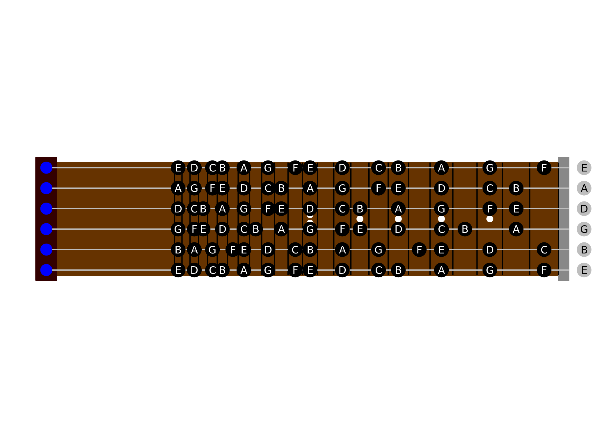

Guitar Fretboard
================

My attempt at:

-   Calculating frequencies of musical scales
-   Calculating circle of 5ths' and 4ths' major and minor scales
-   Drawing guitar fretboard, show natural notes on it

``` r
library(tidyverse)
library(purrr)
source("scale_util.R")
```

### Creates a "circle of fifths" data frame

``` r
tones12 <- tibble(degree=1:13,
                  notes=c("C","C#","D","D#","E","F","F#","G","G#","A","A#","B","C2"),
                  notesF=c("C","Db","D","Eb","E","F","Gb","G","Ab","A","Bb","B","C2"),
                  majorIdx=c(T,F,T,F,T,T,F,T,F,T,F,T,T),
                  minorIdx=c(T,F,T,T,F,T,F,T,T,F,T,F,T),
                  freqMult=accumulate(degree[-13],~.x*semitone,.init=1),
                  freq=middleC*freqMult,
                  # 5ths
                  roots5ths=getRoots(12,8), # P5 is 8th note
                  notes5ths=notes[roots5ths],
                  freq5ths=getFreqSeries(12,freqMult[8]),
                  majorScale5ths=map_chr(roots5ths,getScale,notes,majorIdx),
                  majorSharps5ths=map_chr(majorScale5ths,getSharps),
                  minorScale5ths=map_chr(roots5ths,getScale,notes,minorIdx),   
                  minorSharps5ths=map_chr(minorScale5ths,getSharps),
                  # 4ths
                  roots4ths=getRoots(12,6), # P4 is 6th note
                  notes4ths=notesF[roots4ths],
                  freq4ths=getFreqSeries(12,freqMult[6]),
                  majorScale4ths=map_chr(roots4ths,getScale,notesF,majorIdx),
                  majorFlats4ths=map_chr(majorScale4ths,getFlats),
                  minorScale4ths=map_chr(roots4ths,getScale,notesF,minorIdx),
                  minorFlats4ths=map_chr(minorScale4ths,getFlats)
)
```

### Show: Circle of 5ths' scales

|  degree| root | major\_scale            | major\_sharps       | minor\_scale            | minor\_sharps       |
|-------:|:-----|:------------------------|:--------------------|:------------------------|:--------------------|
|       1| C    | C,D,E,F,G,A,B           |                     | C,D,D\#,F,G,G\#,A\#     | D\#,G\#,A\#         |
|       2| G    | G,A,B,C,D,E,F\#         | F\#                 | G,A,A\#,C,D,D\#,F       | A\#,D\#             |
|       3| D    | D,E,F\#,G,A,B,C\#       | F\#,C\#             | D,E,F,G,A,A\#,C         | A\#                 |
|       4| A    | A,B,C\#,D,E,F\#,G\#     | C\#,F\#,G\#         | A,B,C,D,E,F,G           |                     |
|       5| E    | E,F\#,G\#,A,B,C\#,D\#   | F\#,G\#,C\#,D\#     | E,F\#,G,A,B,C,D         | F\#                 |
|       6| B    | B,C\#,D\#,E,F\#,G\#,A\# | C\#,D\#,F\#,G\#,A\# | B,C\#,D,E,F\#,G,A       | C\#,F\#             |
|       7| F\#  | F\#,G\#,A\#,B,C\#,D\#,F | F\#,G\#,A\#,C\#,D\# | F\#,G\#,A,B,C\#,D,E     | F\#,G\#,C\#         |
|       8| C\#  | C\#,D\#,F,F\#,G\#,A\#,C | C\#,D\#,F\#,G\#,A\# | C\#,D\#,E,F\#,G\#,A,B   | C\#,D\#,F\#,G\#     |
|       9| G\#  | G\#,A\#,C,C\#,D\#,F,G   | G\#,A\#,C\#,D\#     | G\#,A\#,B,C\#,D\#,E,F\# | G\#,A\#,C\#,D\#,F\# |
|      10| D\#  | D\#,F,G,G\#,A\#,C,D     | D\#,G\#,A\#         | D\#,F,F\#,G\#,A\#,B,C\# | D\#,F\#,G\#,A\#,C\# |
|      11| A\#  | A\#,C,D,D\#,F,G,A       | A\#,D\#             | A\#,C,C\#,D\#,F,F\#,G\# | A\#,C\#,D\#,F\#,G\# |
|      12| F    | F,G,A,A\#,C,D,E         | A\#                 | F,G,G\#,A\#,C,C\#,D\#   | G\#,A\#,C\#,D\#     |
|      13| C    | C,D,E,F,G,A,B           |                     | C,D,D\#,F,G,G\#,A\#     | D\#,G\#,A\#         |

### Show: circle of 4ths' scales

|  degree| root | major\_scale       | major\_flats   | minor\_scale       | minor\_flats   |
|-------:|:-----|:-------------------|:---------------|:-------------------|:---------------|
|       1| C    | C,D,E,F,G,A,B      |                | C,D,Eb,F,G,Ab,Bb   | Eb,Ab,Bb       |
|       2| F    | F,G,A,Bb,C,D,E     | Bb             | F,G,Ab,Bb,C,Db,Eb  | Ab,Bb,Db,Eb    |
|       3| Bb   | Bb,C,D,Eb,F,G,A    | Bb,Eb          | Bb,C,Db,Eb,F,Gb,Ab | Bb,Db,Eb,Gb,Ab |
|       4| Eb   | Eb,F,G,Ab,Bb,C,D   | Eb,Ab,Bb       | Eb,F,Gb,Ab,Bb,B,Db | Eb,Gb,Ab,Bb,Db |
|       5| Ab   | Ab,Bb,C,Db,Eb,F,G  | Ab,Bb,Db,Eb    | Ab,Bb,B,Db,Eb,E,Gb | Ab,Bb,Db,Eb,Gb |
|       6| Db   | Db,Eb,F,Gb,Ab,Bb,C | Db,Eb,Gb,Ab,Bb | Db,Eb,E,Gb,Ab,A,B  | Db,Eb,Gb,Ab    |
|       7| Gb   | Gb,Ab,Bb,B,Db,Eb,F | Gb,Ab,Bb,Db,Eb | Gb,Ab,A,B,Db,D,E   | Gb,Ab,Db       |
|       8| B    | B,Db,Eb,E,Gb,Ab,Bb | Db,Eb,Gb,Ab,Bb | B,Db,D,E,Gb,G,A    | Db,Gb          |
|       9| E    | E,Gb,Ab,A,B,Db,Eb  | Gb,Ab,Db,Eb    | E,Gb,G,A,B,C,D     | Gb             |
|      10| A    | A,B,Db,D,E,Gb,Ab   | Db,Gb,Ab       | A,B,C,D,E,F,G      |                |
|      11| D    | D,E,Gb,G,A,B,Db    | Gb,Db          | D,E,F,G,A,Bb,C     | Bb             |
|      12| G    | G,A,B,C,D,E,Gb     | Gb             | G,A,Bb,C,D,Eb,F    | Bb,Eb          |
|      13| C    | C,D,E,F,G,A,B      |                | C,D,Eb,F,G,Ab,Bb   | Eb,Ab,Bb       |

### Draw fretboard w/ naturals

``` r
draw_naturals(tones12)
```


